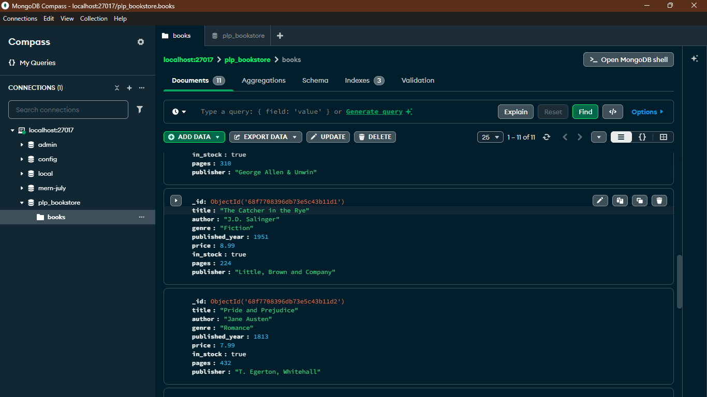
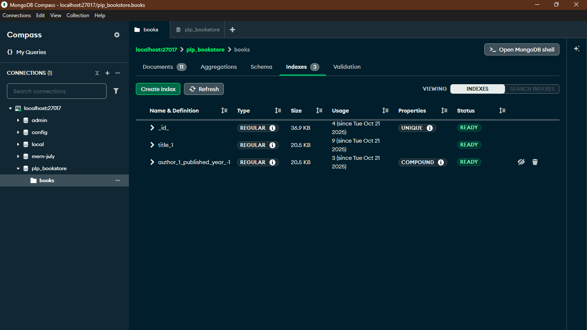

# MongoDB Data Layer Assignment

This project demonstrates fundamental and advanced data manipulation techniques in MongoDB using the official Node.js driver. It includes scripts to populate a database with sample data and to execute a variety of queries, aggregations, and indexing operations as required by the PLP Academy Week 1 assignment.

## Screenshots

### Book Collection

The following screenshot from MongoDB Compass shows the `books` collection populated with sample data within the `plp_bookstore` database.



### Collection Indexes

This screenshot shows the indexes created on the `books` collection to improve query performance, including the `title_1` index and the `author_1_published_year_-1` compound index.



## Prerequisites

Before running the scripts, ensure you have the following installed and running:

1.  **Node.js** (v18 or higher)
2.  **MongoDB Server** (A local instance running on `mongodb://localhost:27017` is expected by the scripts).

## Setup

1.  Clone the repository to your local machine.
2.  Navigate to the project directory in your terminal.
3.  Initialize a new Node.js project, which will create a `package.json` file to manage dependencies:

    ```bash
    npm init -y
    ```

4.  Install the MongoDB Node.js driver, which is required to run the scripts:

    ```bash
    npm install mongodb
    ```

## How to Run the Scripts

The scripts are designed to be run from the root of the project directory.

### 1. Populate the Database

First, run the `insert_books.js` script to populate the `plp_bookstore` database with sample book data. This script will automatically drop any existing `books` collection to ensure a clean insertion.

```bash
node insert_books.js
```

You should see a confirmation message indicating that 12 books were successfully inserted.

### 2. Execute the Queries

After populating the database, run the `queries.js` script to perform all the required CRUD operations, advanced queries, aggregations, and indexing tasks.

```bash
node queries.js
```

The script will output the results of each task sequentially to the console.
